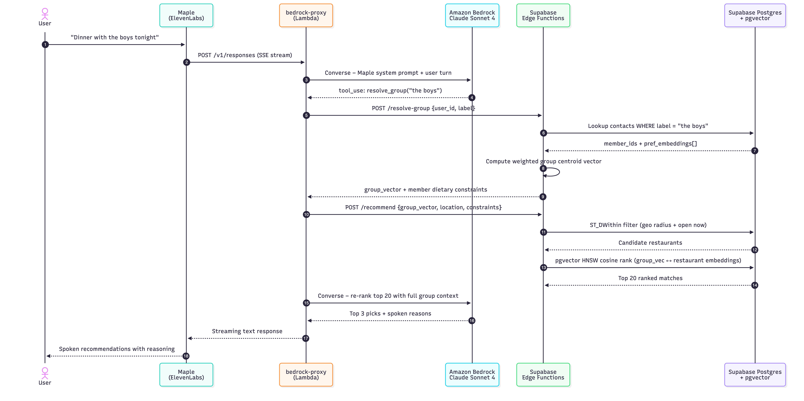
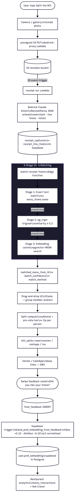
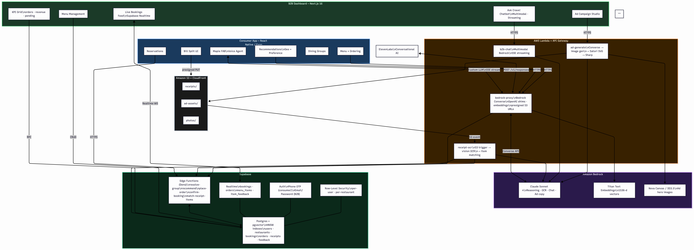
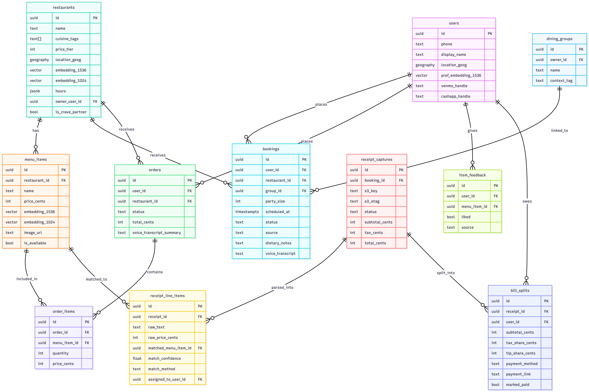

# CRAVE: You Crave It. We Book It.

  

**An AI dining concierge.** Say *"dinner with the boys tonight"*, and a voice agent resolves who's in your group, reconciles what they all like, speaks back the top 3 restaurants and why, books the table, then splits the receipt from a photo.

Built in 24 hours at **Hook 'Em Hacks (UT Austin)** by a team of 4. **Won Most Startup Ready and Best Use of Supabase.**

React Native (Expo) · Next.js 16 · Supabase (pgvector · Realtime · Edge Functions) · AWS Bedrock + Lambda · ElevenLabs

<!--
  The bare user-attachments URL below is what GitHub turns into an inline video player, so
  keep it on a line by itself. To replace it: open a new issue ON THIS PUBLIC REPO, drag the
  .mp4 in, SUBMIT the issue (the asset is only finalized when the comment is saved), then
  copy the new URL and check `curl -sI <url>` returns 302 before pasting it here. Never
  upload from a private repo: since May 2023 those assets require login plus repo access, so
  anonymous readers get a broken player. A <video> tag does not work (GitHub strips it on
  every host), and neither does committing an .mp4 (only GIFs render from the repo tree).
-->

https://github.com/user-attachments/assets/0194d7cf-7d29-4278-82b4-5685dcd87219

<div align="center">
  <sub>Group resolution, voice recommendations, live booking, receipt splitting, and AI ad generation, on real devices.<br>
  Not rendering? <b><a href="https://www.youtube.com/watch?v=Hr566DL5qE8">Watch the 2:47 demo on YouTube</a></b>.</sub>
</div>

---

## Quickstart

**Prerequisites:** Node 20+, npm, a [Supabase](https://supabase.com) project, and AWS credentials with Bedrock model access.

```bash
git clone https://github.com/tanushchauhan/crave && cd crave
cp .env.example .env     # fill in SUPABASE_URL + SUPABASE_ANON_KEY at minimum
```

> **Env lives in the repo root**, not per-app. Both `crave-b2b` and `crave-app` read `../.env*`.
> See [docs/client-env.md](docs/client-env.md). Without it the dashboard returns HTTP 500.

**Restaurant dashboard** at [localhost:3000](http://localhost:3000)

```bash
cd crave-b2b && npm install && npm run dev
```

**Mobile app** on the iOS Simulator (web is not a supported target: the voice agent depends on
native WebRTC, see [crave-app/README.md](crave-app/README.md))

```bash
cd crave-app && npm install && npx expo run:ios -d "iPhone 16"
```

Both apps sit behind auth and read live data, so they need a provisioned backend to show anything:

| Step | Where |
|---|---|
| Apply the 33 SQL migrations + deploy 6 Edge Functions | [docs/supabase.md](docs/supabase.md) · `./scripts/supabase-deploy.sh` |
| Deploy the 4 Lambdas, API Gateway, S3 triggers | [docs/aws.md](docs/aws.md) · `infra/aws/scripts/deploy-aws-from-env.sh` |
| Seed demo restaurants, users, and embeddings | `cd tools/supabase-seed && npm install && npm run seed` |
| Wire the Maple voice agent (ElevenLabs Custom LLM) | [maple-voice-agent/](maple-voice-agent/) · [docs/aws.md](docs/aws.md) |

---

## What is CRAVE?

CRAVE figures out where your group should eat, by actually understanding who's in the group, what they each like, and what the vibe is tonight.

There are two sides to the product:

- **Consumer mobile app** (React Native + Expo): voice-first group dining assistant. Speak naturally, get personalized recommendations, book in-app, split the bill, and give instant feedback, all in one flow.
- **Restaurant B2B dashboard** (Next.js): AI chatbot for analytics, real-time bookings feed, menu management, KPI tracking, and a one-prompt AI ad campaign generator.

---

## Tech Stack

| Layer | Technology |
|---|---|
| Mobile app | React Native 0.81 + Expo 54 |
| B2B dashboard | Next.js 16 + Tailwind CSS 4 + shadcn/ui |
| Voice assistant | ElevenLabs Conversational AI (Custom LLM, "Maple") |
| LLM reasoning | Amazon Bedrock: Claude Sonnet 4 (Converse API) |
| Receipt / doc OCR | Amazon Bedrock: Claude Sonnet 4 (multimodal vision) |
| Text embeddings | Amazon Bedrock: Titan Text Embeddings v1 (1536-d) |
| Image generation | Amazon Bedrock: Nova Canvas / Stability SD3.5 |
| Ad compositing | Satori, Resvg, then Sharp (server-side PNG rendering) |
| Database | Supabase Postgres + pgvector (HNSW indexes) |
| Auth | Supabase Auth: phone OTP (consumer) + email/password (B2B) |
| Realtime | Supabase Realtime (bookings · orders · menu_items · item_feedback) |
| Edge compute | Supabase Edge Functions (Deno), 6 functions |
| Server compute | AWS Lambda (Node.js 20 ES modules) + API Gateway |
| Item matching | pg_trgm trigram + pgvector cosine (3-stage pipeline) |

---

## Four modalities, each load-bearing

1. **Voice in, voice out**: ElevenLabs and Bedrock Claude, connected through an OpenAI-compatible shim proxy
2. **Text to vector search**: a query becomes a 1536-d embedding, then pgvector HNSW cosine ranks restaurants
3. **Image to structure**: a receipt photo passes through Bedrock vision into structured JSON, then item matching
4. **Text to composited image**: a prompt drives Bedrock image generation, an SVG overlay, and a final composited PNG ad

---

## The Six Core Features

### 1. Maple: Conversational Voice Agent
Full-duplex voice powered by **ElevenLabs Conversational AI** with a **custom LLM backend** (Bedrock Claude Sonnet 4 via an OpenAI-compatible proxy). Maple handles the entire dining journey: onboarding, recommendations, menu clarification, order placement, and booking confirmation, all through natural speech.

The headline moment: say *"dinner with the boys"* and Maple resolves your group, fans out to the recommendation engine, and speaks back ranked picks with reasons.

### 2. Group Preference Reconciliation
Each user carries a **1536-d preference embedding** (Amazon Bedrock Titan Text). The `resolve-group` Edge function aggregates the group's embeddings into a weighted centroid, filters on hard dietary constraints, and biases the result by context tag (`"date night"` vs `"with the boys"` vs `"family dinner"`). pgvector HNSW cosine search ranks candidate restaurants against the group vector.

### 3. B2B Chatbot: "Ask Crave!"
Multimodal natural-language Q&A over restaurant analytics. Accepts text, images, and PDFs. Ask *"How did my margherita pizza do last week?"* and Bedrock Claude Sonnet 4 answers with data pulled from the restaurant's analytics tables. Streaming responses. Embedded directly in the dashboard sidebar.

### 4. AI Ad Campaign Studio
One prompt produces **3 distinct ad designs**, each with:
- A hero image generated by Bedrock (Nova Canvas or Stability SD3.5)
- An SVG overlay (Satori, then Resvg) with caption and hashtags composited by Sharp
- Up to 3 image variants per design

All rendered server-side in the `ad-generate` Lambda and returned as PNGs.

### 5. Voice-Driven In-App Ordering
At CRAVE partner restaurants, Maple runs as an overlay on the visual menu. Tell it what you want, it confirms, the `place-order` Edge function creates the order, and the item appears live on the restaurant's B2B dashboard via Supabase Realtime.

### 6. Bill Splitting + Feedback Loop
Snap the receipt and items are parsed, matched, and split in seconds. Each swipe updates your preference embedding.

- Receipt photo uploads through a presigned S3 PUT, which fires a Lambda S3 trigger
- **Bedrock Claude vision** parses receipt to structured JSON (merchant, line items, totals)
- **3-stage item matching**: exact text match, then trigram similarity (pg_trgm), then embedding cosine similarity
- Drag-and-drop assignment UI for putting items onto group member avatars
- Subtotal, pro-rata tax, and a tip slider produce Venmo and CashApp deep links sent per member
- Swipe feedback cards ("was this a hit?") insert a row into `item_feedback`
- Supabase trigger recomputes the user's preference embedding with a weighted blend (likes: +0.15, dislikes: −0.10, L2-normalised)

---

## How a Recommendation Is Produced



---

## Bill Split + Feedback Pipeline



---

## Full System Architecture



---

## Supabase Schema (Key Tables)



---

## Repository Structure

```
crave/
├── crave-app/          # Consumer mobile app (Expo / React Native)
├── crave-b2b/          # Restaurant dashboard (Next.js 16)
├── infra/aws/
│   └── lambdas/
│       ├── bedrock-proxy/    # Bedrock + OpenAI shims for ElevenLabs
│       ├── receipt-ocr/      # S3-triggered OCR + item matching
│       ├── b2b-chat/         # Multimodal B2B chat endpoint
│       └── ad-generate/      # Ad design pipeline
├── supabase/
│   ├── migrations/           # 33 ordered SQL migrations
│   └── functions/            # Deno Edge Functions
│       ├── place-order/
│       ├── confirm-booking/
│       ├── recommend/
│       ├── resolve-group/
│       ├── generate-ad/
│       └── match-receipt-items/
├── maple-voice-agent/        # Maple system prompt
├── scripts/                  # Deploy helpers
├── tools/supabase-seed/      # Demo data seeder
└── docs/                     # Architecture notes
```

---

## What's in the demo

[The 2:47 video](https://www.youtube.com/watch?v=Hr566DL5qE8) runs the full loop on real devices:

1. User opens the app, says *"Dinner with the boys tonight"*
2. Maple speaks back the top 3 picks with reasons, from Supabase `resolve-group` + `recommend` running live
3. User books at a CRAVE partner restaurant and the B2B dashboard pings live on the adjacent laptop (Realtime)
4. Post-meal: snap a receipt, OCR parses it, drag items to avatars, set the tip, hit Send, and a Venmo deep link fires on a second phone
5. Swipe feedback cards appear, and Supabase shows `user.pref_embedding` numerically shift
6. Switch to B2B and ask *"How did my margherita pizza do last week?"*, and Ask Crave! streams a response inline
7. Ask for *"an Instagram ad for our Wagyu burger"* and Ad Campaign Studio returns 3 composited PNGs

Every swipe of feedback moves the user's preference vector, so the next recommendation is better than the last.

---

## License

[MIT](LICENSE) © 2026 Tanush Chauhan
