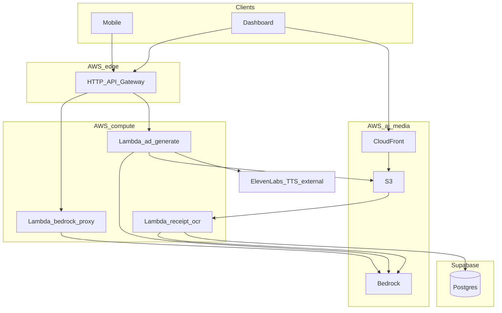

# CRAVE — AWS implementation guide (AWS CLI)

This document is written **for implementing agents** (human or automated). It describes how to provision and operate the AWS side of CRAVE using the **AWS CLI**, aligned with [docs/plan.md](plan.md) section 5.2, section 6, section 3.3 (receipt pipeline), section 4.1 (ad studio; **Live Bookings and Orders** is Supabase Realtime on **`bookings`** + **`orders`** — no extra AWS service), and section 2 / section 8 (voice agent **four tools** routed through Lambda). Supabase schema, RLS, and Edge contracts are in [docs/supabase.md](supabase.md).

**Canonical cross-system contract:** receipt vision output JSON (`ReceiptParse`) and S3 key layout are defined in [docs/supabase.md](supabase.md) section 4 — **do not duplicate conflicting field names** here.

**Documentation map:** [docs/plan.md](plan.md) (product and architecture source of truth) · [docs/supabase.md](supabase.md) (Postgres schema, RLS, Realtime, Edge Functions, `ReceiptParse`).

---

## 0. Prerequisites and order of operations

1. **AWS account** with billing alerts enabled (Bedrock is pay-as-you-go).
2. **AWS CLI v2** installed: `aws --version`.
3. **Credentials:** SSO or access keys; prefer a named profile:
   ```bash
   export AWS_PROFILE=crave-hackathon
   export AWS_REGION=us-east-1
   ```
4. **Region choice:** `us-east-1` typically has the broadest Bedrock foundation model availability. **Agents must still** run `aws bedrock list-foundation-models` (or console) to confirm model IDs for the chosen region.
5. **Deploy order (recommended):**
   1. IAM roles/policies (Lambda execution role, optional API GW account settings).
   2. S3 buckets (receipts + assets) + Block Public Access.
   3. Lambda functions (placeholder code first).
   4. Bedrock model access (console) + smoke `invoke-model` / `converse`.
   5. API Gateway HTTP API + routes → Lambda integrations.
   6. CloudFront distribution in front of public-read assets bucket (or OAC + private bucket — see [section 9](#9-cloudfront-in-front-of-assets_bucket)).
   7. S3 event notification → `receipt-ocr` Lambda + `lambda add-permission` for S3 principal.
   8. End-to-end test: PUT receipt → Lambda → Supabase row update.
   9. Voice tools: confirm mobile → API Gateway → Lambda can reach Edge endpoints for **`place_order`** (and other tools) without embedding long-lived cloud keys in the app ([docs/plan.md](plan.md) section 8).

### 0.1 Hook 'Em Hacks — shared workshop AWS accounts

Hook 'Em Hacks may provide **shared workshop AWS accounts** (teams of 3–4) with **organizer-defined guardrails** (quotas, allowed services, sometimes fixed regions). **Access instructions arrive from organizers** at or before the event — treat those as overriding generic CLI steps where they conflict.

**Product and architecture (Lambda + Bedrock + S3 + API Gateway + Supabase)** stay the same. What changes is **how** you provision inside a shared account:

1. **Credentials and IAM** — You might use **SSO**, a **named profile**, or an **execution role supplied by organizers** instead of creating a net-new `crave-lambda-execution` role and broad inline policies. Lambda still needs **some** identity that can call Bedrock and read/write **your** buckets; map organizer docs to [section 4](#4-iam-lambda-execution-role) (trust + permissions) without assuming full freedom to create IAM entities.

2. **Globally unique names** — S3 bucket names (and some other identifiers) collide across teams in one account. Prefix everything with a **team- or project-specific slug**, e.g. `crave-<team-slug>-receipts`, `crave-<team-slug>-receipt-ocr`, not only `crave-receipts-${ACCOUNT_ID}`.

3. **Bedrock** — **Confirm allowed model IDs and region on day one** (`aws bedrock list-foundation-models` or organizer list). Lock env vars and prompts to **models that are actually enabled** in the workshop; avoid assuming console self-service model access.

4. **Guardrails and cost** — Quotas may cap Lambda concurrency, API traffic, or Bedrock throughput. Prefer **short prompts**, **one vision retry** (already in [plan.md](plan.md) section 10), and **no huge batch embedding jobs** during the event.

5. **CloudFront** — If policy or time blocks CloudFront, **defer it**: presigned **S3** GET/PUT URLs still satisfy receipts and ad assets for the demo ([section 9](#9-cloudfront-in-front-of-assets_bucket) becomes optional).

6. **Secrets** — Shared accounts increase blast radius if keys leak. Keep **Supabase service role** and **ElevenLabs** keys in **Lambda env / Secrets Manager** only; never commit them; rotate if exposed.

---

## 1. Goals and track alignment (Best Use of AWS)

| AWS service | CRAVE usage | Plan reference |
|-------------|-------------|----------------|
| **Amazon Bedrock** | **Claude** (text + tools + re-rank); **Claude vision** for receipt → `ReceiptParse` JSON; **Titan Embeddings G1 – Text** (1536) + **Titan Multimodal Embeddings G1** (1024) for vectors; **SD3 / Titan Image** for ad stills | [plan.md section 3.2](plan.md#32-ai-model-stack), section 3.3, section 5.2 |
| **Lambda** | Bedrock invoke/converse; **voice-tool router** to Supabase Edge ([plan.md section 8](plan.md#8-24-hour-build-timeline)); receipt OCR; ad images; Remotion render job; **server-side ElevenLabs** HTTP calls for narration (API keys only here) | [plan.md section 5.2](plan.md#52-aws--free-tier-only-usage-best-use-of-aws-track), section 6 |
| **API Gateway** | HTTP APIs for Lambdas | section 5.2, section 6 |
| **S3** | **All** object storage for the hackathon: receipts, restaurant + menu images, generated ad stills, rendered video. Postgres stores HTTPS/S3 URLs only. | section 3.3, section 4.1, [docs/supabase.md](supabase.md) object-storage section |
| **CloudFront** | CDN for ad creative delivery | section 5.2 |
| **Rekognition** (optional) | Photo “vibe” exploration | section 5.2 |

**ElevenLabs (not AWS):** all **speech** (consumer Conversational AI on device + **TTS for ad / Remotion narration** via Lambda). Product story: “**ElevenLabs = voice**, **Bedrock = every other model**.”

**Headline story for judges:** “**Bedrock** runs reasoning, embeddings, vision OCR, and image generation; **Supabase** is system of record + realtime; **ElevenLabs** is the voice layer.” ([plan.md section 5.2](plan.md#52-aws--free-tier-only-usage-best-use-of-aws-track))

---

## 2. CLI baseline commands

```bash
aws sts get-caller-identity
aws configure list
```

List Bedrock models (CLI output is large — pipe to `grep`):

```bash
aws bedrock list-foundation-models --region "$AWS_REGION" \
  --query "modelSummaries[?contains(modelId, 'claude')].{id:modelId,name:modelName}" --output table
```

**Model access:** many foundation models require **one-time access** in the Bedrock console (AWS console → Bedrock → Model access). The CLI cannot grant access; agents must verify in console before demo day ([plan.md section 10 — Risks](plan.md#10-risks-for-the-24-hours), [section 11 — Submission checklist](plan.md#11-submission-checklist)).

---

## 3. Configuration table (agents fill in actual IDs)

Maintain this table in the repo or team wiki as values are chosen. **All vectors in Supabase must match the output dimension of the Bedrock embedding model you pick** ([docs/plan.md](plan.md) section 3.2).

### 3.1 Core model IDs (defaults aligned with plan)

| Purpose | Model (Bedrock console) | Output / notes | Example model ID (verify in your region) | IAM actions |
|---------|-------------------------|----------------|------------------------------------------|---------------|
| Text + tool use | Anthropic **Claude** (Sonnet-class) | Text | e.g. `anthropic.claude-3-5-sonnet-...` | `bedrock:InvokeModel`, `bedrock:Converse` |
| Receipt vision → JSON | **Claude** multimodal (same or lighter model) | Strict JSON per [docs/supabase.md](supabase.md) section 4 | region-specific | same |
| **Text embeddings (1536)** | **Amazon Titan Embeddings G1 – Text** (v1.2) | Fixed **1536**-dim → matches `vector(1536)` in Postgres | set from console / `list-foundation-models` | `bedrock:InvokeModel` |
| **Image / multimodal embeddings (1024)** | **Amazon Titan Multimodal Embeddings G1** (default 1024) | TEXT + IMAGE input; default vector **1024** → matches `vector(1024)` | region-specific | `bedrock:InvokeModel` |
| Ad stills | **SD3**, **Titan Image**, or other granted image model | Images to S3 | region-specific | `bedrock:InvokeModel` |

### 3.2 Other Bedrock-listed embedding models (dimension changes only)

These appear in the Bedrock model catalog; use **only** if you intentionally change Postgres `vector(n)` widths and re-seed — not parallel runtimes:

| Model | Modalities | Vector sizes (typical) | Max input (typical) |
|-------|------------|-------------------------|---------------------|
| **Titan Text Embeddings V2** | TEXT | 1024 (default), 512, 256 | 8k tokens |
| **Titan Multimodal Embeddings G1** | TEXT, IMAGE | 1024 (default), 384, 256 | 128 tokens |
| **Titan Embeddings G1 – Text** | TEXT | **1536** fixed | 8k tokens |
| **Amazon Nova Multimodal Embeddings** | TEXT, IMAGE, AUDIO, VIDEO | per console | 8k+ tokens |
| **Cohere Embed English / Multilingual v3** | TEXT | 1024 | 512 tokens |
| **Cohere Embed v4** | TEXT, IMAGE | per console | up to 128k tokens |
| **TwelveLabs Marengo** | TEXT, IMAGE, SPEECH, VIDEO | per console | large video/audio |

---


## 4. IAM — Lambda execution role

### 4.1 Trust policy (`lambda-trust.json`)

```json
{
  "Version": "2012-10-17",
  "Statement": [
    {
      "Effect": "Allow",
      "Principal": { "Service": "lambda.amazonaws.com" },
      "Action": "sts:AssumeRole"
    }
  ]
}
```

### 4.2 Create role

```bash
aws iam create-role \
  --role-name crave-lambda-execution \
  --assume-role-policy-document file://lambda-trust.json
```

Attach AWS managed policy for basic logs:

```bash
aws iam attach-role-policy \
  --role-name crave-lambda-execution \
  --policy-arn arn:aws:iam::aws:policy/service-role/AWSLambdaBasicExecutionRole
```

### 4.3 Inline policy for Bedrock + S3 (tighten ARNs)

Create `crave-lambda-inline.json` (replace `ACCOUNT_ID`, bucket names, and Bedrock ARNs with your account):

```json
{
  "Version": "2012-10-17",
  "Statement": [
    {
      "Sid": "BedrockInvokeScoped",
      "Effect": "Allow",
      "Action": ["bedrock:InvokeModel", "bedrock:Converse"],
      "Resource": [
        "arn:aws:bedrock:*::foundation-model/*",
        "arn:aws:bedrock:us-east-1:ACCOUNT_ID:inference-profile/*"
      ]
    },
    {
      "Sid": "ReceiptBucketRW",
      "Effect": "Allow",
      "Action": ["s3:GetObject", "s3:PutObject", "s3:DeleteObject"],
      "Resource": [
        "arn:aws:s3:::crave-receipts-ACCOUNT_ID/*",
        "arn:aws:s3:::crave-assets-ACCOUNT_ID/*"
      ]
    },
    {
      "Sid": "ListBucketsForHead",
      "Effect": "Allow",
      "Action": ["s3:ListBucket"],
      "Resource": [
        "arn:aws:s3:::crave-receipts-ACCOUNT_ID",
        "arn:aws:s3:::crave-assets-ACCOUNT_ID"
      ]
    }
  ]
}
```

Hackathon shortcut uses broad foundation-model ARN patterns; **for production**, scope to each approved model ARN from console / `list-foundation-models`.

```bash
aws iam put-role-policy \
  --role-name crave-lambda-execution \
  --policy-name CraveBedrockAndS3 \
  --policy-document file://crave-lambda-inline.json
```

Fetch role ARN:

```bash
aws iam get-role --role-name crave-lambda-execution --query 'Role.Arn' --output text
```

---

## 5. S3 buckets and object layout

### 5.1 Create buckets

```bash
ACCOUNT_ID=$(aws sts get-caller-identity --query Account --output text)
RECEIPTS_BUCKET="crave-receipts-${ACCOUNT_ID}"
ASSETS_BUCKET="crave-assets-${ACCOUNT_ID}"

aws s3api create-bucket --bucket "$RECEIPTS_BUCKET" --region "$AWS_REGION" \
  $(if [ "$AWS_REGION" != "us-east-1" ]; then echo "--create-bucket-configuration LocationConstraint=$AWS_REGION"; fi)

aws s3api create-bucket --bucket "$ASSETS_BUCKET" --region "$AWS_REGION" \
  $(if [ "$AWS_REGION" != "us-east-1" ]; then echo "--create-bucket-configuration LocationConstraint=$AWS_REGION"; fi)
```

### 5.2 Block Public Access (keep ON)

```bash
aws s3api put-public-access-block \
  --bucket "$RECEIPTS_BUCKET" \
  --public-access-block-configuration \
  BlockPublicAcls=true,IgnorePublicAcls=true,BlockPublicPolicy=true,RestrictPublicBuckets=true

aws s3api put-public-access-block \
  --bucket "$ASSETS_BUCKET" \
  --public-access-block-configuration \
  BlockPublicAcls=true,IgnorePublicAcls=true,BlockPublicPolicy=true,RestrictPublicBuckets=true
```

### 5.3 Encryption (SSE-S3 hackathon default)

```bash
aws s3api put-bucket-encryption --bucket "$RECEIPTS_BUCKET" \
  --server-side-encryption-configuration '{"Rules":[{"ApplyServerSideEncryptionByDefault":{"SSEAlgorithm":"AES256"}}]}'
aws s3api put-bucket-encryption --bucket "$ASSETS_BUCKET" \
  --server-side-encryption-configuration '{"Rules":[{"ApplyServerSideEncryptionByDefault":{"SSEAlgorithm":"AES256"}}]}'
```

### 5.4 Key layout (must match [plan.md section 3.3](plan.md#33-bill-splitting--post-meal-feedback-loop-how-it-feeds-the-pipeline))

| Domain | Key pattern | Content-Type |
|--------|-------------|----------------|
| Receipts | `receipts/{user_id}/{booking_id}.jpg` | `image/jpeg` |
| Restaurant / menu photos | `media/restaurants/{restaurant_id}/header.{ext}` or `media/restaurants/{restaurant_id}/menu/{menu_item_id}.{ext}` | `image/jpeg` or `image/webp` |
| Ad images | `ads/{restaurant_id}/{campaign_id}/{asset_id}.png` | `image/png` |
| Rendered video | `ads/{restaurant_id}/{campaign_id}/{asset_id}.mp4` | `video/mp4` |

Store the resulting object URL in Postgres (`restaurants.photo_urls[]`, `menu_items.image_url`, `receipt_captures.image_s3_url`, `ad_assets.s3_url`). **Do not** use Supabase Storage for these binaries in this project.

### 5.5 CORS for browser / app direct PUT (if used)

Prefer **presigned URLs** from Lambda so buckets stay private. If configuring CORS on `RECEIPTS_BUCKET`:

```json
{
  "CORSRules": [
    {
      "AllowedOrigins": ["http://localhost:3000", "http://localhost:8081"],
      "AllowedMethods": ["PUT", "GET", "HEAD"],
      "AllowedHeaders": ["*"],
      "ExposeHeaders": ["ETag"],
      "MaxAgeSeconds": 3000
    }
  ]
}
```

```bash
aws s3api put-bucket-cors --bucket "$RECEIPTS_BUCKET" --cors-configuration file://receipts-cors.json
```

Extend `AllowedOrigins` with Vercel preview URLs as needed.

---

## 6. Lambda functions

Use **Node.js 20.x** runtimes unless the team standardizes on Python. Below uses **zip** deployment for hackathon velocity; container images are optional.

### 6.1 Function: `receipt-ocr`

**Trigger:** S3 `ObjectCreated:*` on prefix `receipts/`.

**Behavior:**

1. Read object from `RECEIPTS_BUCKET`.
2. Call Bedrock **Converse** or **InvokeModel** with image bytes + prompt: return JSON matching [docs/supabase.md](supabase.md) section 4 (`ReceiptParse`).
3. Validate JSON (e.g. Ajv schema in Lambda).
4. Upsert `receipt_captures` in Supabase:
   - Prefer **Supabase REST** with **service role** key stored in **Lambda environment variable** `SUPABASE_SERVICE_ROLE_KEY` (never ship to clients), **or** call a secured Edge Function that writes with service role on server.
5. Insert `receipt_line_items` rows (normalized cents) with `match_method` null until matcher runs.
6. Invoke Edge Function `match-receipt-items` with HMAC header if that is your internal auth pattern ([docs/supabase.md](supabase.md) section 11).

**Env vars (example):**

| Variable | Purpose |
|----------|---------|
| `SUPABASE_URL` | `https://<ref>.supabase.co` |
| `SUPABASE_SERVICE_ROLE_KEY` | Server-only writes |
| `RECEIPT_PARSE_MODEL_ID` | Bedrock model ID |
| `MATCH_RECEIPT_EDGE_URL` | HTTPS URL of Supabase Edge |
| `INTERNAL_HMAC_SECRET` | Shared secret Edge validates |

**Idempotency:** S3 can deliver duplicate events. Use `s3_etag` + `receipt_captures` unique constraint or check before heavy Bedrock calls.

**Timeout / memory:** start with **timeout 60s**, **memory 1024MB** for vision calls.

#### Deploy skeleton (zip)

```bash
ROLE_ARN=$(aws iam get-role --role-name crave-lambda-execution --query 'Role.Arn' --output text)

cd /path/to/receipt-ocr-bundle
zip -r function.zip .

aws lambda create-function \
  --function-name crave-receipt-ocr \
  --runtime nodejs20.x \
  --role "$ROLE_ARN" \
  --handler index.handler \
  --zip-file fileb://function.zip \
  --timeout 60 \
  --memory-size 1024 \
  --environment "Variables={SUPABASE_URL=$SUPABASE_URL,SUPABASE_SERVICE_ROLE_KEY=$SUPABASE_SERVICE_ROLE_KEY,RECEIPT_PARSE_MODEL_ID=$RECEIPT_PARSE_MODEL_ID}"
```

Updates:

```bash
aws lambda update-function-code --function-name crave-receipt-ocr --zip-file fileb://function.zip
```

### 6.2 Function: `bedrock-proxy` (and voice tool fan-out)

**Trigger:** API Gateway routes (see [section 8.2](#82-example-routes)).

**Behavior:**

1. **Shared gate (voice + native Bedrock):** validate Supabase **JWT** (JWKS from `${SUPABASE_URL}/auth/v1/.well-known/jwks.json`) or HMAC from a trusted Edge relay; reject anonymous abuse. *(The current Lambda checks presence of `Authorization` for `/bedrock/converse` and `/voice/*`; tighten to JWKS when time allows.)*
2. **Bedrock paths:** `POST /bedrock/converse` forwards **Bedrock-native** `messages` to **Converse**. **`POST /v1/chat/completions`** is an **OpenAI Chat Completions**-shaped shim for **ElevenLabs Custom LLM**: same Converse model as `BEDROCK_TEXT_MODEL_ID`, but auth is **`Authorization: Bearer <ELEVENLABS_CUSTOM_LLM_SECRET>`** (use the same value as the Custom LLM API key in ElevenLabs). The request `model` field is echoed in the response. **`stream`**: if **`stream: false`**, the response is a single JSON **`chat.completion`**. Otherwise (including **`stream: true`**, as ElevenLabs sends), the response is **`text/event-stream`** OpenAI-style SSE: `data: {…chat.completion.chunk…}\n\n` chunks (each **`choices[]`** entry includes **`logprobs: null`**, matching OpenAI’s stream shape), then **`data: [DONE]\n\n`** (required by [ElevenLabs Custom LLM](https://elevenlabs.io/docs/conversational-ai/customization/custom-llm)). Bedrock failures return **HTTP 200** with an SSE **`error`** object plus **`[DONE]`** so the agent UI can surface the message instead of a generic upstream failure. OpenAI **`tools`** in the body are not supported in the shim (use **client tools** in the app for CRAVE tools). **`POST /v1/responses`** is the **OpenAI Responses**-shaped alternative: maps **`input`** (string or message array) and optional **`instructions`** to **Converse**; when streaming, responses use **`event:`** + **`data:`** lines (`response.output_text.delta`, `response.completed`, then **`data: [DONE]`**) per [ElevenLabs Custom LLM](https://elevenlabs.io/docs/conversational-ai/customization/custom-llm).
3. **Data paths (no Bedrock):** routes under `POST /voice/*` (e.g. **`place-order`**, **`resolve-group`**, **`recommend`**, **`confirm-booking`**) forward to Supabase Edge with the same user JWT. Persisted rows for orders live in Postgres ([docs/supabase.md](supabase.md) section 6.4); partner **`bookings`** use Edge **`confirm-booking`** so the agent never needs the service role on device.

Keep **one** Lambda codebase with internal modules per route to stay within hackathon deploy complexity.

### 6.3 Function: `b2b-chat`

**Trigger:** API Gateway **`POST /b2b/chat`** (see [section 8.2](#82-example-routes)).

**Behavior:** B2B dashboard **multimodal chat** — accepts an OpenAI-style **`messages`** array (client keeps history and sends the full thread each turn). **`user`** content may be a string or an array of parts: **`text`**, **`image_url`** (`data:image/...;base64,...`), **`file`** (PDF as base64 + filename). Maps to **Bedrock Converse** with model **`B2B_CHAT_MODEL_ID`** (defaults to **`BEDROCK_TEXT_MODEL_ID`** when unset; use Claude Sonnet 4 inference profile, e.g. `us.anthropic.claude-sonnet-4-20250514-v1:0`). Auth: **`Authorization: Bearer <B2B_CHAT_SECRET>`** (dashboard server or Next.js API route holds the secret; do not expose in browser if you require zero-trust). Response: single JSON **`chat.completion`** (non-streaming) for easy use with the OpenAI SDK pointed at this route.

### 6.4 Function: `ad-generate`

**Trigger:** API Gateway from B2B dashboard.

**Behavior:** Bedrock image model → `PutObject` to `ASSETS_BUCKET` → return **CloudFront URL** or **presigned GET** URL; dashboard then saves row via Supabase `ad_assets`.

### 6.5 Function: `remotion-render` (stretch)

**Trigger:** async invocation from `ad-generate` or SQS (if added).

**Behavior:** Pull stills from S3, generate narration audio via **ElevenLabs** HTTP API (from Lambda, using `ELEVENLABS_API_KEY` in env / Secrets Manager), mux with Remotion, output MP4 to S3. Remotion-in-Lambda is non-trivial — keep scope to a single happy-path render for the demo.

---

## 7. Wire S3 events to `receipt-ocr`

### 7.1 Allow S3 to invoke Lambda

```bash
aws lambda add-permission \
  --function-name crave-receipt-ocr \
  --statement-id s3invoke-receipts \
  --action lambda:InvokeFunction \
  --principal s3.amazonaws.com \
  --source-arn "arn:aws:s3:::${RECEIPTS_BUCKET}"
```

### 7.2 Notification configuration (`notifications.json`)

Replace `LAMBDA_ARN` with full ARN of `crave-receipt-ocr`.

```json
{
  "LambdaFunctionConfigurations": [
    {
      "Id": "receipt-created",
      "LambdaFunctionArn": "LAMBDA_ARN",
      "Events": ["s3:ObjectCreated:*"],
      "Filter": {
        "Key": {
          "FilterRules": [{ "Name": "prefix", "Value": "receipts/" }]
        }
      }
    }
  ]
}
```

```bash
aws s3api put-bucket-notification-configuration \
  --bucket "$RECEIPTS_BUCKET" \
  --notification-configuration file://notifications.json
```

**Ordering note:** `add-permission` must succeed **before** attaching notification or S3 may show configuration errors.

---

## 8. API Gateway (HTTP API)

HTTP APIs are cheaper/simpler for hackathon demos ([plan.md section 5.2](plan.md#52-aws--free-tier-only-usage-best-use-of-aws-track)).

### 8.1 Create API

```bash
API_ID=$(aws apigatewayv2 create-api \
  --name crave-http \
  --protocol-type HTTP \
  --query ApiId --output text)
echo "$API_ID"
```

### 8.2 Example routes

| Method | Route | Integration target |
|--------|-------|----------------------|
| POST | `/receipts/signed-url` | Lambda: returns presigned PUT URL for mobile upload |
| POST | `/v1/chat/completions` | `bedrock-proxy`: OpenAI Chat Completions → Bedrock **Converse** (ElevenLabs Custom LLM); Bearer **`ELEVENLABS_CUSTOM_LLM_SECRET`** |
| POST | `/v1/responses` | `bedrock-proxy`: OpenAI Responses API (`input`, `instructions`, …) → **Converse**; same Bearer; SSE uses **`event:`** lines per ElevenLabs |
| POST | `/bedrock/converse` | `bedrock-proxy` (Claude / Nova / etc.) |
| POST | `/b2b/chat` | **`crave-b2b-chat`**: OpenAI-style **`messages`** (text + optional image/PDF parts) → Bedrock **Converse**; Bearer **`B2B_CHAT_SECRET`**; model **`B2B_CHAT_MODEL_ID`** or **`BEDROCK_TEXT_MODEL_ID`** |
| POST | `/voice/place-order` | `bedrock-proxy`: forwards body + JWT to Edge **`place-order`** — **`orders` / `order_items`** ([docs/plan.md](plan.md) section 2 feature 5, [docs/supabase.md](supabase.md) section 11) |
| POST | `/voice/resolve-group` | `bedrock-proxy` → Edge **`resolve-group`** (group resolution for the voice agent) |
| POST | `/voice/recommend` | `bedrock-proxy` → Edge **`recommend`** |
| POST | `/voice/confirm-booking` | `bedrock-proxy` → Edge **`confirm-booking`** (partner **`bookings`** row, `source=partner_app`) |
| POST | `/ads/generate` | `ad-generate` |

**ElevenLabs Custom LLM:** point the Custom LLM URL at the **full** path **`https://<api-id>.execute-api.<region>.amazonaws.com/v1/chat/completions`** or **`…/v1/responses`**. Routes are registered only under **`/v1/…`**; a URL that omits **`/v1`** (for example **`…amazonaws.com/responses`**) never hits the Lambda and returns API Gateway **`404`** with body **`{"message":"Not Found"}`**.

Create Lambda integrations (repeat per function):

```bash
aws apigatewayv2 create-integration \
  --api-id "$API_ID" \
  --integration-type AWS_PROXY \
  --integration-uri "arn:aws:lambda:${AWS_REGION}:${ACCOUNT_ID}:function:crave-ad-generate" \
  --payload-format-version "2.0" \
  --integration-method POST
```

Create routes and attach integration IDs (store IDs from CLI output).

### 8.3 CORS for HTTP API

```bash
aws apigatewayv2 update-api \
  --api-id "$API_ID" \
  --cors-configuration AllowOrigins="http://localhost:3000,http://localhost:8081",AllowMethods="GET,POST,OPTIONS",AllowHeaders="authorization,content-type"
```

### 8.4 Invoke URL

```bash
aws apigatewayv2 get-api --api-id "$API_ID" --query ApiEndpoint --output text
```

Clients call `POST https://<id>.execute-api.<region>.amazonaws.com/ads/generate` during dev.

---

## 9. CloudFront in front of `ASSETS_BUCKET`

Use **Origin Access Control (OAC)** so the bucket stays private while CloudFront reads objects.

High-level CLI flow (agents often use a JSON file for `create-distribution`):

1. `aws cloudfront create-origin-access-control --origin-access-control-config ...`
2. Build `distribution.json` with:
   - **Origins:** S3 bucket origin, `OriginAccessControlId` set.
   - **Default cache behavior:** `ViewerProtocolPolicy: redirect-to-https`, `AllowedMethods: GET, HEAD, OPTIONS`.
   - **Bucket policy:** allow `cloudfront.amazonaws.com` `s3:GetObject` for distribution ARN condition.

Because `create-distribution` payloads are verbose, **recommended hackathon path:**

1. Create distribution **once** in the AWS console using S3 origin + OAC wizard.
2. Export settings via CLI for documentation:

```bash
aws cloudfront get-distribution-config --id YOUR_DIST_ID > dist-config.json
```

3. Document the **domain name** `dxxxx.cloudfront.net` for Next.js `NEXT_PUBLIC_CDN_URL`.

**Caching:** use content-hashed filenames in S3 keys (`{asset_id}.png`) for long `max-age` ([docs/plan.md](plan.md) section 4.1 ad studio).

---

## 10. Bedrock invocation smoke tests

### 10.1 `Converse` (preferred for multimodal)

Prepare `payload.json` per current Bedrock Converse API for your chosen model (structure differs for Anthropic vs Amazon models — use `aws bedrock-runtime converse` help and AWS examples).

Skeleton **Anthropic**-style messages (illustrative only — **verify** against official docs):

```bash
aws bedrock-runtime converse \
  --model-id "$RECEIPT_PARSE_MODEL_ID" \
  --messages file://messages.json \
  --inference-config '{"maxTokens":1024,"temperature":0}' \
  --region "$AWS_REGION"
```

### 10.2 Receipt prompt requirements

The model must return **only** JSON matching [docs/supabase.md](supabase.md) section 4. Lambda should:

1. Parse JSON; on failure, **one retry** with stricter system prompt ([plan.md section 10](plan.md#10-risks-for-the-24-hours)).
2. If still invalid after retry, return a structured error to the client — do **not** substitute a second vendor or canned JSON path in-stack; fix the prompt or receipt image.

---

## 11. ElevenLabs narration (outside AWS CLI)

Ad and Remotion workflows use **ElevenLabs** for **TTS**, not Amazon Polly. There is no `aws elevenlabs` CLI — implement in Lambda with HTTPS (`fetch` / axios) to the [ElevenLabs API](https://elevenlabs.io/docs), store `ELEVENLABS_API_KEY` in **AWS Secrets Manager** or Lambda environment (encrypted). Keep keys off mobile; only Lambda (or a trusted CI job) calls ElevenLabs for batch narration.

**Conversational agent (mobile):** Prefer **ElevenLabs Conversational AI** with the device (or their SDK) maintaining the **low-latency audio stream to ElevenLabs**, while **tool calls** from that agent hit **`bedrock-proxy` → Supabase Edge** (this repo). Do **not** tunnel full-duplex conversation audio through Lambda: API Gateway and Lambda payload/time limits are a poor fit for streaming PCM, and you add an extra network hop and cost. If you must avoid any ElevenLabs client secret in the app, mint a **short-lived agent / conversation token** from Lambda (or Supabase Edge) and still let audio flow **client ↔ ElevenLabs**, not client ↔ Lambda ↔ ElevenLabs for every utterance.

---

## 12. Observability and cost

- **CloudWatch Logs:** one log group per Lambda (`/aws/lambda/crave-receipt-ocr`, etc.). Retention: set **7 days** for hackathon cost control:
  ```bash
  aws logs put-retention-policy --log-group-name /aws/lambda/crave-receipt-ocr --retention-in-days 7
  ```
- **Bedrock cost:** dominated by image + long context calls; keep demo prompts short. Link: [AWS Bedrock pricing](https://aws.amazon.com/bedrock/pricing/).

---

## 13. Verification checklist (AWS)

- [ ] `aws sts get-caller-identity` returns expected account.
- [ ] Bedrock: model access enabled in console; `converse` / `invoke-model` smoke succeeds.
- [ ] S3: `aws s3api head-bucket --bucket "$RECEIPTS_BUCKET"`.
- [ ] Lambda: `aws lambda invoke --function-name crave-receipt-ocr --payload file://test-s3-event.json out.json` (local test with sample S3 event).
- [ ] S3 → Lambda: upload `receipts/test-user/test-booking.jpg` and confirm CloudWatch logs + Supabase `receipt_captures.ocr_raw` populated.
- [ ] API Gateway: `curl` POST to `/ads/generate` returns URL field.
- [ ] Voice paths: authenticated `curl` POST to `/voice/place-order`, `/voice/resolve-group`, `/voice/recommend`, `/voice/confirm-booking` return expected JSON; **`place-order`** / **`confirm-booking`** create rows in **`orders`** / **`bookings`** (verify in SQL editor or MCP `execute_sql`).
- [ ] CloudFront: `curl -I https://dxxxx.cloudfront.net/...` returns `200` for public asset behavior (or signed URL works).

---

## 14. Architecture diagram



---

## 15. Cross-reference index to [docs/plan.md](plan.md)

| Topic | Plan section |
|-------|----------------|
| Receipt S3 + Lambda + Bedrock | 3.3 |
| Voice tools → Lambda → Edge | 2, 8 |
| Ad studio assets | 4.1 |
| AWS service matrix | 5.2 |
| Architecture diagram | 6 |
| Track strategy + model story | 9 |
| Risks | 10 |
| Submission checklist (AWS bullets) | 11 |

---

## 16. Related Supabase document

Database schema, `ReceiptParse` JSON, RLS, Realtime bookings, Edge Function contracts: [docs/supabase.md](supabase.md).
