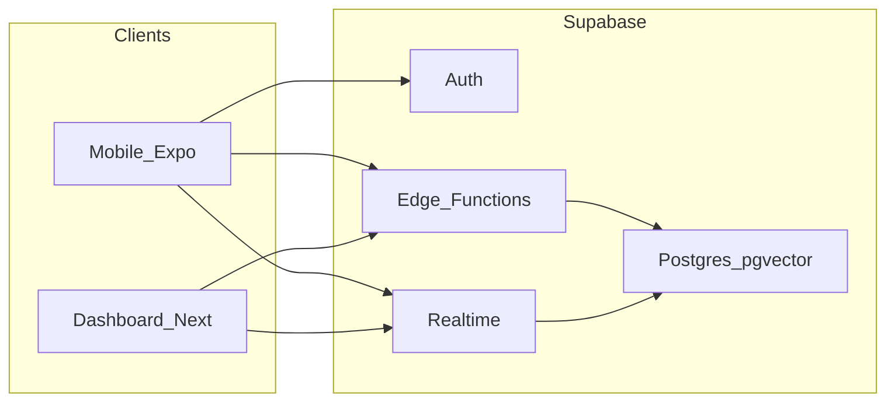

# CRAVE — Supabase implementation guide

This document is written **for implementing agents** (human or automated). It turns the product intent in [docs/plan.md](plan.md) into an ordered, verifiable Supabase rollout. Mobile and dashboard UX flows are summarized in [plan.md section 2](plan.md#2-what-were-building).

**Documentation map:** [docs/plan.md](plan.md) (product and architecture source of truth) · [docs/aws.md](aws.md) (S3, Lambda, Bedrock, API Gateway, CloudFront).

**Primary architecture reference:** [docs/plan.md](plan.md) — especially section 3 (data + AI flows), section 4 (B2B + chatbot), section 5.1 (Supabase feature matrix), section 6 (diagram), section 7 (data model), section 9 (track strategy), sections 10–11 (risks + submission checklist).

---

## 0. Prerequisites and order of operations

1. **Supabase project** exists (region chosen for latency to Austin demo users and team).
2. **Personal Access Token (PAT)** for Supabase is available to the MCP client (Cursor: Settings → MCP). Never commit the PAT.
3. **Execute in this order:**
   - Enable extensions → core tables → indexes → RLS policies → helper functions/triggers → Realtime publication → Edge Functions → seed data. (**Object files live in S3**, not Supabase Storage — see [§7](#7-object-storage-s3-only).)
4. **Application clients** (Expo mobile, **Next.js B2B app [crave-b2b](../crave-b2b/)**) consume only the **anon** key + **project URL** on the client. **Service role** is server-only (Edge Functions, AWS Lambda, CI seed jobs).

---

## 1. Goals and track alignment (Best Use of Supabase)

Map each Supabase primitive to a **load-bearing** CRAVE feature so judges and downstream agents see intentional design (see [docs/plan.md](plan.md) section 5.1 and section 9).

| Supabase capability | CRAVE usage |
|---------------------|-------------|
| **Postgres** | Users, groups, restaurants (**`owner_user_id`** for B2B), **menu items** (`is_available`), **`orders` / `order_items`**, bookings, receipts, splits, feedback, ads, analytics events ([plan.md section 7](plan.md#7-data-model-postgres--supabase)). |
| **pgvector + HNSW** | Vectors produced by **Amazon Bedrock** (Titan Text G1 @ 1536 for text columns; Titan Multimodal G1 @ 1024 for image columns per [plan.md section 3.2](plan.md#32-ai-model-stack)); group recommendation and receipt line ↔ menu matching stage 3 ([plan.md section 3.3](plan.md#33-bill-splitting--post-meal-feedback-loop-how-it-feeds-the-pipeline)). |
| **pg_trgm** | Receipt line ↔ menu fuzzy match stage 2 ([plan.md section 3.3](plan.md#33-bill-splitting--post-meal-feedback-loop-how-it-feeds-the-pipeline)). |
| **PostGIS** | “Within radius” restaurant filter; store `location_geog` as `geography(Point,4326)` ([plan.md section 3.5 step 4](plan.md#35-how-a-recommendation-is-actually-produced-simplified-for-24-hours)). |
| **Auth (phone OTP)** | **Consumer** (Expo): phone-number onboarding; enables SMS-adjacent flows ([plan.md section 2](plan.md#2-what-were-building)). |
| **Auth (email/password)** | **B2B** ([crave-b2b](../crave-b2b/)): restaurant operators use email + password; signup collects **restaurant name** and, after session exists, calls RPC **`register_restaurant_on_signup`** to set **`restaurants.owner_user_id`** (claim by `lower(trim(name))` match or insert new row). See [§6.9](#69-b2b-ownership-no-separate-staff-table) and [§10](#10-auth). |
| **Realtime** | **Live Bookings and Orders** on the B2B dashboard ([plan.md section 4.1](plan.md#41-dashboard-pages-what-ships-for-the-demo) item 2): partner **`bookings`** ([plan.md section 4.3](plan.md#43-partner-booking-flow--how-bookings-reach-the-dashboard)) and partner **`orders`** both publish to Realtime; optional group vote sync if implemented ([plan.md section 5.1 table](plan.md#51-supabase--what-we-use-it-for-best-use-of-supabase-track)). |
| **Storage (Supabase)** | **Not used** for CRAVE binaries in this hackathon — receipts, menu images, and ad creative all go to **Amazon S3** ([docs/aws.md](aws.md)); Postgres stores URLs only ([§7](#7-object-storage-s3-only)). |
| **Edge Functions (Deno)** | Deployed names: **`resolve-group`**, **`recommend`**, **`place-order`**, **`confirm-booking`**, **`match-receipt-items`**, optional **`generate-ad`** — map to voice tools `resolve_group`, `recommend_restaurants`, `confirm_booking`, `place_order` ([plan.md section 8](plan.md#8-24-hour-build-timeline)). |
| **RLS** | **`restaurants.owner_user_id`** scopes B2B reads/writes; consumer rows scoped per-user; **`assert_restaurant_owner`** in RPCs for chatbot tools ([plan.md section 4.2](plan.md#42-just-ask-crave--chatbot-data-sources-and-architecture)). |

---

## 2. Supabase MCP — setup, tools, and mandatory agent workflow

Official reference: [Model context protocol (MCP) | Supabase Docs](https://supabase.com/docs/guides/getting-started/mcp).

### 2.1 Hosted project MCP URL

Configure Cursor (or another MCP client) with a URL of the form:

```text
https://mcp.supabase.com/mcp?project_ref=<YOUR_PROJECT_REF>
```

Optional query flags (see Supabase MCP docs for current behavior):

- `read_only=true` — routes database tools through a read-only role. **Use on shared or production-like projects** when exploring schema or running analytics.
- Combine parameters as documented, e.g. `project_ref` + `read_only`.

### 2.2 Local Supabase MCP

When running the stack locally via Supabase CLI, the MCP endpoint is typically:

```text
http://localhost:54321/mcp
```

Use this for rapid iteration; sync migrations to hosted when ready.

### 2.3 Tool groups (conceptual)

The MCP server exposes tools grouped by **Database**, **Debugging**, **Development**, **Account management**, **Docs**, and (on paid plans) **Branching**. **Always read the live tool schema** in your MCP client before calling tools — names and parameters can change between releases.

Documented tool families (verify against your client):

| Area | Typical tools | Agent usage |
|------|----------------|------------|
| Database | `list_tables`, `list_extensions`, `list_migrations`, `apply_migration`, `execute_sql` | Schema via `apply_migration`; seeds/diagnostics via `execute_sql`. |
| Debugging | `get_logs`, `get_advisors` | Unblock integrations; fix RLS/perf warnings. |
| Development | `get_project_url`, `get_publishable_keys`, `generate_typescript_types`, `list_edge_functions`, `get_edge_function`, `deploy_edge_function` | Wire env vars; ship Edge Functions; generate types into `packages/shared` when the monorepo exists. |
| Docs | `search_docs` | RLS, Realtime, Auth edge cases. |

### 2.4 Mandatory workflow for schema changes

1. **Read** the MCP tool descriptor/schema in Cursor before invoking write tools.
2. **All DDL** (extensions, tables, views, indexes, policies, functions, triggers) must go through **`apply_migration`** with a **unique migration name** (snake_case timestamp prefix recommended, e.g. `20260418_enable_extensions`). This records history in Supabase migration metadata — critical for team agents and rollback narrative.
3. Use **`execute_sql`** for:
   - one-off **DML** (seed runs),
   - **diagnostic selects**,
   - **ad hoc inspection** (not for permanent schema).
4. After migrations: **`list_migrations`**, **`list_tables`**, **`list_extensions`** to verify.
5. On failures: **`get_logs`** with service types such as `postgres`, `api`, `auth`, `realtime`, `storage`, `edge_functions`.
6. On unclear semantics: **`search_docs`** (RLS `WITH CHECK`, Realtime filters, Auth hooks).
7. When app code exists: **`generate_typescript_types`** and commit output to the shared package.
8. Edge Functions: **`deploy_edge_function`** after local validation; use **`get_edge_function`** to confirm deployed source.

### 2.5 Security rules for agents

- **Never** put the **service role** key in Expo or Next.js client bundles.
- Prefer **`read_only=true`** MCP when not intentionally migrating.
- Reddit and Supabase discussions report destructive mistakes when LLMs run unrestricted SQL — treat **`execute_sql`** on production-linked projects as **dangerous**; default to migrations + review.
- Community note: prefer **`apply_migration`** over ad-hoc DDL in **`execute_sql`** so the migration graph stays truthful.

---

## 3. Environment variables (wiring apps)

After schema is stable, fetch from MCP (or dashboard):

| MCP / dashboard | App env var | Consumer of |
|-----------------|-------------|-------------|
| Project URL | `EXPO_PUBLIC_SUPABASE_URL`, `NEXT_PUBLIC_SUPABASE_URL` | Mobile, Dashboard |
| Anon / publishable key | `EXPO_PUBLIC_SUPABASE_ANON_KEY`, `NEXT_PUBLIC_SUPABASE_ANON_KEY` | Mobile, Dashboard |
| Service role (dashboard only, server routes, Edge secrets, Lambda env) | `SUPABASE_SERVICE_ROLE_KEY` | Edge Functions, Next.js server, AWS Lambda |

**Edge Functions secrets** (Supabase CLI or dashboard): e.g. `BEDROCK_PROXY_URL` or `LAMBDA_TOOL_BASE_URL` (always prefer **Lambda** for Bedrock and for any **ElevenLabs** server-side calls so API keys never ship in the mobile app), `AWS_REGION`, internal HMAC signing secrets for webhook-style calls from Lambda. Do **not** add non-Bedrock embedding API keys — vectors come from Bedrock per [plan.md section 3.2](plan.md#32-ai-model-stack).

### 3.1 Onboarding preference capture (plan section 2 + section 3.1)

After phone OTP, the user **must complete exactly one** of two paths to seed `users.pref_embedding` ([plan.md section 2](plan.md#2-what-were-building), [plan.md section 3.1](plan.md#31-where-the-recommendations-come-from-data-sources)):

1. **Talk to a voice agent** — transcript (or a short structured summary from the agent) is embedded with **Bedrock Titan Text G1 – Text** (1536-d), same as the other path.
2. **Select foods you like** — user picks from a curated list; concatenate or aggregate the selection into text, then **the same** Titan embedding pipeline.

**Contract:** both paths must land on the **same data shape**: `users.pref_embedding vector(1536)` (and optionally **`user_pref_updates`** rows with `source = 'onboarding'`). Do not maintain two different preference representations.

The **section 3.1** table in [docs/plan.md](plan.md) lists this as **Onboarding preference capture**. Optional future sources (socials, uploaded order history) are out of scope for the hackathon; see [plan.md section 12](plan.md#12-parking-lot--ideas-were-not-building-now).

---

## 4. Canonical `ReceiptParse` JSON (Bedrock ↔ Postgres ↔ matcher)

This shape is the **contract** between AWS (Bedrock vision output in Lambda) and CRAVE (stored in `receipt_captures.ocr_raw`, parsed into cents columns). It must stay aligned with [docs/plan.md](plan.md) section 3.3; Lambda should **validate JSON against this schema** and may **retry the Bedrock call once** with a stricter prompt if parsing fails ([plan.md section 10](plan.md#10-risks-for-the-24-hours)).

**Rules:**

- All monetary fields in JSON are **decimal strings in major currency units** (e.g. `"12.99"`). Table columns use **integer cents** filled by Lambda/Edge normalization — do not mix integer cents into `ReceiptParse` JSON or validators will drift.
- `line_items` order is preserved for UI chips.

```json
{
  "schema_version": 1,
  "merchant_name": "string",
  "currency": "USD",
  "subtotal": "0.00",
  "tax": "0.00",
  "total": "0.00",
  "line_items": [
    {
      "description": "string",
      "quantity": 1,
      "unit_price": "0.00",
      "line_total": "0.00"
    }
  ],
  "confidence_notes": "string | null"
}
```

**Normalization** (implement in Lambda or Edge after Bedrock returns):

- Parse `subtotal`, `tax`, `total`, each `line_total` into `subtotal_cents`, `tax_cents`, `total_cents`, `raw_price_cents` on `receipt_line_items`.
- Store the **raw model JSON** (including any extra keys Bedrock returned) in `receipt_captures.ocr_raw` for audit ([plan.md section 3.3 step 3](plan.md#33-bill-splitting--post-meal-feedback-loop-how-it-feeds-the-pipeline)).

---

## 5. Extensions and migration sequencing

Use **one logical concern per migration** via MCP `apply_migration` so rollback and code review stay clear.

Suggested sequence (migration names are examples):

| # | Repo migration file | Purpose |
|---|---------------------|---------|
| 1 | `20260418000001_enable_extensions.sql` | `vector`, `pg_trgm`; PostGIS if available on project tier. |
| 2 | `20260418000002_core_identity_and_groups.sql` | `users`, contacts, `dining_groups`, `group_members`, enums. |
| 3 | `20260418000003_restaurants_and_menu.sql` | `restaurants` (**`owner_user_id`** links the B2B dashboard `auth.users` row for RLS), `menu_items` + **`is_available`**, HNSW + trigram + GiST indexes. |
| 4 | `20260418000004_bookings_and_dietary.sql` | `bookings`, `dietary_constraints`, indexes. |
| 5 | `20260418000005_receipts_and_splits.sql` | `receipt_captures`, `receipt_line_items`, `bill_splits`. |
| 6 | `20260418000006_feedback_and_prefs.sql` | `item_feedback`, `user_pref_updates`, triggers/functions. |
| 7 | `20260418000007_analytics_and_ads.sql` | `impressions`, `menu_interactions`, `ad_campaigns`, `ad_assets`. |
| 8 | `20260418000008_rls_policies.sql` | RLS on user-facing tables; owner-scoped writes on `restaurants` / `menu_items` / ads. |
| 9 | `20260418000009_realtime_publication.sql` | `ALTER PUBLICATION supabase_realtime ADD TABLE public.bookings`. |
| 10 | `20260418000010_chatbot_rpcs.sql` | `assert_restaurant_owner` + B2B read RPCs (`get_booking_summary`, etc.). |
| 11 | `20260418000011_orders_and_lines.sql` | `orders`, `order_items`, order RLS, **`ALTER PUBLICATION … ADD TABLE public.orders`** for the **orders** half of Live Bookings and Orders. |
| 12 | `20260418000012_rename_pref_update_swipe_to_onboarding.sql` | No-op on fresh installs; renames enum label `swipe` → `onboarding` if an older DB still has `swipe`. |
| 13 | `20260419150000_register_restaurant_on_signup.sql` | **`register_restaurant_on_signup(p_restaurant_name text)`** — `SECURITY DEFINER` RPC for B2B signup: insert or claim **`restaurants`** row for **`auth.uid()`** (RLS does not allow raw client insert/claim). `GRANT EXECUTE` to **`authenticated`**. |

### 5.1 PostGIS availability

Supabase supports **PostGIS** on standard Postgres. If `create extension postgis` fails on a given org/tier, store `latitude` / `longitude` as `double precision` and filter with haversine in SQL or move radius filter to application — document the deviation in the PR.

---

## 6. DDL reference (copy into `apply_migration` calls)

The following consolidates [docs/plan.md](plan.md) section 7 into runnable SQL. **Table name note:** SQL reserved words make a table named `groups` awkward; this guide uses **`dining_groups`** as the physical table name mapping to the plan’s “groups” concept.

### 6.1 Migration: extensions

```sql
create extension if not exists vector with schema extensions;
create extension if not exists pg_trgm;
-- If using public.geography without PostGIS, skip this:
create extension if not exists postgis;
```

If `vector` must live in `public` per project policy, adjust paths and recreate indexes after consultation with `list_extensions`.

### 6.2 Migration: enums and core tables

```sql
-- Booking source / status / receipt status (extend as needed)
create type booking_source as enum ('partner_app', 'phone_call_logged');
create type booking_status as enum ('pending', 'confirmed', 'cancelled', 'completed');
create type receipt_capture_status as enum (
  'uploaded',
  'ocr_done',
  'split_sent',
  'feedback_collected'
);
create type match_method as enum ('exact', 'trigram', 'embedding', 'manual');
create type payment_method as enum ('venmo', 'cashapp', 'iou');
create type pref_update_source as enum ('bill_split_feedback', 'booking', 'onboarding');
create type feedback_source as enum ('bill_split', 'doordash', 'uber_eats');

-- 1:1 with auth.users — consumer profile
create table public.users (
  id uuid primary key references auth.users (id) on delete cascade,
  phone text,
  display_name text,
  location_geog geography (point, 4326),
  pref_embedding vector (1536),
  venmo_handle text,
  cashapp_handle text,
  created_at timestamptz not null default now()
);

create table public.contacts (
  id uuid primary key default gen_random_uuid (),
  owner_user_id uuid not null references public.users (id) on delete cascade,
  contact_user_id uuid references public.users (id) on delete set null,
  label text,
  created_at timestamptz not null default now(),
  unique (owner_user_id, contact_user_id)
);

create table public.dining_groups (
  id uuid primary key default gen_random_uuid (),
  name text not null,
  owner_id uuid not null references public.users (id) on delete cascade,
  context_tag text,
  created_at timestamptz not null default now()
);

create table public.group_members (
  group_id uuid not null references public.dining_groups (id) on delete cascade,
  user_id uuid not null references public.users (id) on delete cascade,
  joined_at timestamptz not null default now(),
  primary key (group_id, user_id)
);
```

**Trigger:** on `auth.users` insert, **optionally** mirror phone into `public.users` or create `public.users` row from a secure signup flow. Minimal pattern for agents:

```sql
create function public.handle_new_auth_user ()
returns trigger
language plpgsql
security definer
set search_path = public
as $$
begin
  insert into public.users (id, phone)
  values (new.id, new.phone);
  return new;
end;
$$;

create trigger on_auth_user_created
  after insert on auth.users
  for each row
execute function public.handle_new_auth_user ();
```

(Adjust if you use email-first; CRAVE is phone-first per plan.)

### 6.3 Migration: restaurants and menu

```sql
create table public.restaurants (
  id uuid primary key default gen_random_uuid (),
  name text not null,
  cuisine_tags text[] default '{}',
  price_tier smallint check (price_tier between 1 and 4),
  location_geog geography (point, 4326),
  embedding vector (1536),
  image_embedding vector (1024),
  hours jsonb default '{}',
  photo_urls text[] default '{}',
  yelp_id text,
  google_place_id text,
  phone_e164 text,
  is_crave_partner boolean not null default false,
  owner_user_id uuid references auth.users (id) on delete set null,
  created_at timestamptz not null default now()
);

create table public.menu_items (
  id uuid primary key default gen_random_uuid (),
  restaurant_id uuid not null references public.restaurants (id) on delete cascade,
  name text not null,
  description text,
  price_cents integer not null check (price_cents >= 0),
  image_url text,
  embedding vector (1536),
  image_embedding vector (1024),
  is_available boolean not null default true,
  created_at timestamptz not null default now()
);

-- Seed or a service-role Edge route must set `owner_user_id` when onboarding a partner;
-- the B2B JWT is then authorized for that restaurant’s rows via RLS.

create index restaurants_embedding_hnsw on public.restaurants
  using hnsw (embedding vector_cosine_ops);
create index restaurants_image_embedding_hnsw on public.restaurants
  using hnsw (image_embedding vector_cosine_ops);
create index menu_items_embedding_hnsw on public.menu_items
  using hnsw (embedding vector_cosine_ops);
create index menu_items_name_trgm on public.menu_items using gin (name gin_trgm_ops);
create index restaurants_location_gist on public.restaurants using gist (location_geog);
```

If HNSW index creation fails, check `list_extensions` for where `vector` is installed and follow [Supabase pgvector docs](https://supabase.com/docs/guides/database/extensions/pgvector) for operator class / `search_path` on your Postgres version.

### 6.4 Migration: orders and order lines (voice-driven ordering)

Partner **voice-driven in-app ordering** ([plan.md section 2](plan.md#2-what-were-building) feature 5, [plan.md section 4.1](plan.md#41-dashboard-pages-what-ships-for-the-demo) items 2–3) persists rows here; the B2B **Live Bookings and Orders** surface subscribes via Realtime on `orders` (alongside `bookings`).

```sql
create type order_status as enum (
  'pending',
  'confirmed',
  'preparing',
  'ready',
  'completed',
  'cancelled'
);

create table public.orders (
  id uuid primary key default gen_random_uuid (),
  user_id uuid not null references public.users (id) on delete cascade,
  restaurant_id uuid not null references public.restaurants (id) on delete cascade,
  status order_status not null default 'pending',
  total_cents integer not null check (total_cents >= 0),
  voice_transcript_summary text,
  created_at timestamptz not null default now()
);

create table public.order_items (
  id uuid primary key default gen_random_uuid (),
  order_id uuid not null references public.orders (id) on delete cascade,
  menu_item_id uuid not null references public.menu_items (id) on delete restrict,
  quantity numeric(10, 2) not null default 1 check (quantity > 0),
  price_cents integer not null check (price_cents >= 0)
);

create index orders_restaurant_created_at on public.orders (restaurant_id, created_at desc);
create index order_items_order on public.order_items (order_id);
```

**Notes for agents:**

- `price_cents` on `order_items` is a **snapshot** at order time (menu prices can change via Live Menu Management).
- Only allow inserts when `restaurants.is_crave_partner = true` and items are `is_available` (enforce in Edge `place-order` or a `SECURITY DEFINER` RPC).

### 6.5 Migration: bookings and dietary

```sql
create table public.bookings (
  id uuid primary key default gen_random_uuid (),
  user_id uuid not null references public.users (id) on delete cascade,
  group_id uuid references public.dining_groups (id) on delete set null,
  restaurant_id uuid references public.restaurants (id) on delete set null,
  party_size smallint not null check (party_size > 0),
  scheduled_at timestamptz,
  status booking_status not null default 'pending',
  source booking_source not null,
  voice_transcript text,
  dietary_notes text,
  context_tag text,
  created_at timestamptz not null default now()
);

create index bookings_restaurant_created_at on public.bookings (restaurant_id, created_at desc);
create index bookings_user_created_at on public.bookings (user_id, created_at desc);

create table public.dietary_constraints (
  user_id uuid not null references public.users (id) on delete cascade,
  constraint_type text not null,
  hard boolean not null default true,
  primary key (user_id, constraint_type)
);
```

### 6.6 Migration: receipts and bill splits

```sql
create table public.receipt_captures (
  id uuid primary key default gen_random_uuid (),
  user_id uuid not null references public.users (id) on delete cascade,
  booking_id uuid references public.bookings (id) on delete set null,
  image_s3_url text not null,
  ocr_raw jsonb,
  merchant_matched_restaurant_id uuid references public.restaurants (id),
  subtotal_cents integer,
  tax_cents integer,
  total_cents integer,
  status receipt_capture_status not null default 'uploaded',
  s3_etag text,
  created_at timestamptz not null default now()
);

create table public.receipt_line_items (
  id uuid primary key default gen_random_uuid (),
  receipt_id uuid not null references public.receipt_captures (id) on delete cascade,
  raw_text text not null,
  raw_price_cents integer not null,
  quantity numeric(10, 2) not null default 1,
  matched_menu_item_id uuid references public.menu_items (id),
  match_confidence double precision,
  match_method match_method,
  assigned_to_user_id uuid references public.users (id)
);

create index receipt_line_items_receipt on public.receipt_line_items (receipt_id);

create table public.bill_splits (
  id uuid primary key default gen_random_uuid (),
  receipt_id uuid not null references public.receipt_captures (id) on delete cascade,
  user_id uuid not null references public.users (id) on delete cascade,
  subtotal_cents integer not null,
  tax_share_cents integer not null,
  tip_share_cents integer not null,
  total_cents integer not null,
  payment_link text,
  payment_method payment_method not null,
  marked_paid boolean not null default false,
  created_at timestamptz not null default now()
);
```

### 6.7 Migration: feedback and preference updates

```sql
create table public.item_feedback (
  id uuid primary key default gen_random_uuid (),
  user_id uuid not null references public.users (id) on delete cascade,
  restaurant_id uuid not null references public.restaurants (id) on delete cascade,
  menu_item_id uuid references public.menu_items (id) on delete set null,
  raw_item_text text,
  liked boolean not null,
  source feedback_source not null default 'bill_split',
  created_at timestamptz not null default now()
);

create index item_feedback_restaurant_menu on public.item_feedback (restaurant_id, menu_item_id);

create table public.user_pref_updates (
  id uuid primary key default gen_random_uuid (),
  user_id uuid not null references public.users (id) on delete cascade,
  delta_embedding vector (1536),
  source pref_update_source not null,
  applied boolean not null default false,
  created_at timestamptz not null default now()
);

create index user_pref_updates_pending on public.user_pref_updates (user_id)
  where applied = false;
```

### 6.8 Migration: analytics and ads

```sql
create table public.impressions (
  id uuid primary key default gen_random_uuid (),
  restaurant_id uuid not null references public.restaurants (id) on delete cascade,
  user_id uuid references public.users (id) on delete set null,
  source text,
  context_tag text,
  created_at timestamptz not null default now()
);

create table public.menu_interactions (
  id uuid primary key default gen_random_uuid (),
  menu_item_id uuid not null references public.menu_items (id) on delete cascade,
  user_id uuid references public.users (id) on delete set null,
  action text not null,
  created_at timestamptz not null default now()
);

create table public.ad_campaigns (
  id uuid primary key default gen_random_uuid (),
  restaurant_id uuid not null references public.restaurants (id) on delete cascade,
  prompt text not null,
  status text not null default 'draft',
  created_at timestamptz not null default now()
);

create table public.ad_assets (
  id uuid primary key default gen_random_uuid (),
  campaign_id uuid not null references public.ad_campaigns (id) on delete cascade,
  type text not null,
  s3_url text not null,
  generation_meta jsonb,
  created_at timestamptz not null default now()
);
```

### 6.9 B2B ownership (no separate staff table)

Restaurant-scoped dashboard access uses **`restaurants.owner_user_id`** → `auth.users.id` for the partner account. **There is no `restaurant_staff` join table** — it added migration overhead without benefit at hackathon scope (one owner per venue is enough).

**How `owner_user_id` gets set today**

1. **Seed / demo:** **seed SQL** can attach a known `auth` user to a curated partner row (see [§13](#13-seeds-and-demo-data)).
2. **B2B self-serve (crave-b2b):** After **`auth.signUp`** / **`signInWithPassword`**, the dashboard calls **`public.register_restaurant_on_signup(p_restaurant_name text)`** (migration **`20260419150000_register_restaurant_on_signup.sql`**). The function runs as **`SECURITY DEFINER`** so it can **`INSERT`** a new **`restaurants`** row or **`UPDATE owner_user_id`** when no conflicting owner exists (case-insensitive match on **`lower(trim(name))`**; errors: **`restaurant_already_claimed`**, **`ambiguous_restaurant_name`**). Client RLS does not allow unprivileged inserts on **`restaurants`**, so this RPC is required for the signup flow.
3. **Legacy option:** a **service-role** Edge or admin step can still set **`owner_user_id`** when a partner is onboarded outside the app.

Client RLS gates analytics, ads, bookings, and orders to `exists (select 1 from restaurants r where r.id = … and r.owner_user_id = auth.uid())`.

---

## 7. Object storage (S3 only)

All binaries for CRAVE — **receipt photos**, **restaurant / menu images**, **generated ad stills**, **rendered video** — live in **Amazon S3** (presigned PUT/GET from Lambda; optional CloudFront for ads). See key layout in [docs/aws.md](aws.md) §5.4.

**Postgres stores URLs only:** `receipt_captures.image_s3_url`, `menu_items.image_url`, `restaurants.photo_urls[]`, `ad_assets.s3_url`, etc.

**Supabase Storage is not part of this stack** for those files — skip Storage buckets for CRAVE media so there is a single object-store story for judges ([docs/plan.md](plan.md) §5.2).

---

## 8. Row-Level Security (RLS)

### 8.1 Principles

1. **Enable RLS** on every table exposed to PostgREST (`anon` / `authenticated`).
2. **Consumers** (`authenticated` role, `auth.uid()`): CRUD only on rows they own or are group members of.
3. **Restaurant owners (B2B)**: SELECT/INSERT/UPDATE on partner data where **`restaurants.owner_user_id = auth.uid()`** for that `restaurant_id`.
4. **Service role** bypasses RLS — use only on server.
5. **Chatbot** must not use free-form SQL from the LLM; use parametrized RPC or Edge with fixed queries ([plan.md section 4.2](plan.md#42-just-ask-crave--chatbot-data-sources-and-architecture)).

### 8.2 Example policy patterns (illustrative — test in staging)

```sql
alter table public.users enable row level security;

create policy users_select_self on public.users
  for select using (id = auth.uid());

create policy users_update_self on public.users
  for update using (id = auth.uid());
```

```sql
alter table public.bookings enable row level security;

create policy bookings_select_participant on public.bookings
  for select using (
    user_id = auth.uid()
    or exists (
      select 1 from public.group_members gm
      where gm.group_id = bookings.group_id and gm.user_id = auth.uid()
    )
    or exists (
      select 1 from public.restaurants r
      where r.id = bookings.restaurant_id and r.owner_user_id = auth.uid()
    )
  );

create policy bookings_insert_authenticated on public.bookings
  for insert with check (user_id = auth.uid());
```

**`orders` / `order_items` (orders portion of Live Bookings and Orders):** consumers **insert** their own orders (placed via voice tool); the restaurant **owner** **select**s (and optionally **update**s `orders.status`) when `restaurants.owner_user_id = auth.uid()`. The shipped migration `20260418000011_orders_and_lines.sql` implements this; the snippet below matches that intent:

```sql
alter table public.orders enable row level security;

create policy orders_insert_own on public.orders
  for insert with check (user_id = auth.uid());

create policy orders_select_owner_or_restaurant_owner on public.orders
  for select using (
    user_id = auth.uid()
    or exists (
      select 1 from public.restaurants r
      where r.id = orders.restaurant_id and r.owner_user_id = auth.uid()
    )
  );

-- order_items: join to parent order the caller may see
alter table public.order_items enable row level security;

create policy order_items_select_via_order on public.order_items
  for select using (
    exists (
      select 1 from public.orders o
      where o.id = order_items.order_id
        and (
          o.user_id = auth.uid()
          or exists (
            select 1 from public.restaurants r
            where r.id = o.restaurant_id and r.owner_user_id = auth.uid()
          )
        )
    )
  );
```

For **`order_items` inserts**, either (a) perform all writes from **`place-order` Edge** using the **service role** after validating the caller JWT (simplest for hackathon), or (b) add `insert` policies keyed off `orders.user_id = auth.uid()` and matching `menu_item_id` ownership.

**`menu_items` (Live Menu Management):** the restaurant **owner** needs `update` (and optionally `insert`/`delete`) on rows for their `restaurant_id` only; consumers typically **select** rows where `is_available = true` for partner menu browsing.

**Owner-scoped policies** for other B2B tables (`item_feedback` read for owners, `impressions`, `ad_campaigns`, etc.) use the same pattern: `exists (select 1 from restaurants r where r.id = <row>.restaurant_id and r.owner_user_id = auth.uid())`.

### 8.3 RPC for chatbot tools

Expose **narrow** functions such as `get_booking_summary(p_restaurant_id uuid, ...)` marked `SECURITY DEFINER` with **internal** checks (see pattern below). When order volume matters for “menu performance” or ops Q&A, add a sibling such as `get_order_summary(...)` backed by **`orders` ⋈ `order_items`** — extend dashboard tool lists in lockstep with [plan.md section 4.2](plan.md#42-just-ask-crave--chatbot-data-sources-and-architecture) as the product evolves.

**Pattern:**

```sql
-- Pseudocode pattern
if not exists (
  select 1 from public.restaurants r
  where r.id = p_restaurant_id and r.owner_user_id = auth.uid()
) then
  raise exception 'forbidden';
end if;
```

Grant `execute` to `authenticated` or to a dedicated `dashboard_user` role as appropriate.

### 8.4 Verifying RLS

MCP cannot impersonate arbitrary JWTs easily. Agents should:

1. Use **`get_advisors`** for security warnings.
2. Run integration tests from Next.js / Expo with real `anon` keys and two test users.
3. Use Supabase SQL editor with role switching where available.

---

## 9. Realtime

### 9.1 Tables to publish

Minimum for the B2B demo in [docs/plan.md](plan.md) section 4.1 and section 4.3:

- **`bookings`** — **Live Bookings and Orders** (bookings half; [plan.md section 4.3](plan.md#43-partner-booking-flow--how-bookings-reach-the-dashboard)).
- **`orders`** — **Live Bookings and Orders** (orders half for voice-placed orders; [plan.md section 4.1](plan.md#41-dashboard-pages-what-ships-for-the-demo) item 2).

Optional (if built):

- **`group_votes`** (not in section 7 DDL — add a migration if implementing live voting).

### 9.2 Publication SQL

In the repo this is split across migrations so `orders` exists before it is published:

```sql
-- 20260418000009_realtime_publication.sql
alter publication supabase_realtime add table public.bookings;

-- 20260418000011_orders_and_lines.sql (after `orders` is created)
alter publication supabase_realtime add table public.orders;
```

If Supabase version requires `replica identity full` for certain filters, consult `search_docs` for current guidance.

### 9.3 Client subscription shape

- **Filter:** `filter=restaurant_id=eq.<uuid>` on `postgres_changes` for **`bookings`** and **`orders`** INSERT/UPDATE.
- **Channels:** stable strings e.g. `bookings:restaurant:<uuid>` and `orders:restaurant:<uuid>` (or one multiplexed channel with handler branching on `payload.table`).

Conceptual Next.js (one **Live Bookings and Orders** UI still uses two `postgres_changes` subscriptions — or one channel branching on `payload.table`):

```ts
// Conceptual — adjust to @supabase/supabase-js v2 API
supabase.channel(`bookings:${restaurantId}`)
  .on('postgres_changes', {
    event: 'INSERT',
    schema: 'public',
    table: 'bookings',
    filter: `restaurant_id=eq.${restaurantId}`,
  }, payload => { /* append row */ })
  .subscribe();

supabase.channel(`orders:${restaurantId}`)
  .on('postgres_changes', {
    event: 'INSERT',
    schema: 'public',
    table: 'orders',
    filter: `restaurant_id=eq.${restaurantId}`,
  }, payload => { /* append kitchen ticket */ })
  .subscribe();
```

---

## 10. Auth

### 10.1 Consumer (Expo) — phone OTP

Supabase dashboard steps (often **not** exposed to MCP — document for humans):

1. Authentication → Providers → **Phone** enabled.
2. Configure SMS provider (Twilio/MessageBird) per Supabase docs.
3. Set **redirect URLs** for the Expo deep link scheme (see [supabase/config.toml](../supabase/config.toml)). For **B2B** email magic links and OAuth-style callbacks, add the URLs documented in [§10.2](#102-b2b-crave-b2b--email--password) (`/auth/callback` on localhost and production).

**SMS group invites** ([plan.md section 2](plan.md#2-what-were-building)): optional table `pending_phone_invites (id, inviter_user_id, phone_e164, group_id, token, created_at)` with RLS; sending SMS may be external (Twilio) or deferred to in-app share sheet for hackathon scope.

### 10.2 B2B (crave-b2b) — email / password

The **[crave-b2b](../crave-b2b/)** Next.js app uses **Supabase Auth** with **Email** provider (sign up / sign in / password reset). It is separate from the consumer **phone OTP** story above.

1. Authentication → Providers → **Email** enabled (default on most projects).
2. **Redirect URLs:** add **`http://localhost:3000/auth/callback`** and production **`https://<vercel-host>/auth/callback`** so email confirmation and recovery links return to [crave-b2b/app/auth/callback/route.ts](../crave-b2b/app/auth/callback/route.ts) (PKCE **`exchangeCodeForSession`**).
3. **Signup flow:** the client sends **`auth.signUp`** with **`options.data.pending_restaurant_name`** (stored in **`auth.users.raw_user_meta_data`**). If a **session** is returned immediately (email confirmation off), the app calls **`supabase.rpc('register_restaurant_on_signup', { p_restaurant_name })`**. If confirmation is required, the **callback** route reads **`user.user_metadata.pending_restaurant_name`** after exchange and runs the same RPC once.

Env wiring for monorepo root **`.env`**: see [docs/client-env.md](client-env.md) (`SUPABASE_*` ↔ **`NEXT_PUBLIC_*`** in **crave-b2b** `next.config.ts`).

---

## 11. Edge Functions — names, contracts, and AWS split

| Function | Transport | Auth | Responsibility |
|----------|-----------|------|------------------|
| `resolve-group` | HTTPS POST | **`Authorization: Bearer <access_token>`** (gateway **`verify_jwt = false`** in [supabase/config.toml](../supabase/config.toml); **`getUser()`** inside the function) | JSON body optional **`nickname`** / **`group_hint`**. Finds the newest **`dining_groups`** row visible to the user whose **`name`** or **`context_tag`** matches (**`ilike`**), then calls RPC **`list_group_members_with_prefs(p_group_id)`** and returns **`group_id`**, **`group_name`**, and **`members`** (`user_id`, `phone`, `display_name`, **`pref_embedding`** as a number array when present). Empty **`members`** when no group matches. Maps to voice tool `resolve_group`. |
| `recommend` | HTTPS POST | **`Authorization: Bearer <access_token>`** (gateway **`verify_jwt = false`** in [supabase/config.toml](../supabase/config.toml) because ES256 session JWTs can be rejected as `UNAUTHORIZED_UNSUPPORTED_TOKEN_ALGORITHM` at the edge; the function calls **`getUser()`** then RPC) | JSON body: **`limit`** (1–50, default 12); optional **`lat`**, **`lng`** (WGS84), **`radius_m`** (meters; Edge clamps **500–50_000**, default **5000** when coords are sent). RPC **`recommend_restaurants_for_user`** ranks by cosine (`restaurants.embedding` vs `users.pref_embedding` when set; else partner / `created_at`). When **`lat`/`lng`** are present, Postgres filters with **`ST_DWithin`** on **`restaurants.location_geog`**; if that returns **no rows**, the RPC falls back to the same ranking **without** geo so the list stays non-empty. Attaches **`menu_items`** per venue. Optional Bedrock re-rank via Lambda remains future work ([docs/aws.md](aws.md)). Maps to `recommend_restaurants`. |
| `place-order` | HTTPS POST | User JWT | Validates partner + menu availability, inserts **`orders` + `order_items`**, returns order id for confirmation UI; triggers Realtime on **`orders`** for Live Bookings and Orders ([plan.md section 2](plan.md#2-what-were-building) feature 5, [plan.md section 8](plan.md#8-24-hour-build-timeline) voice tools). |
| `confirm-booking` | HTTPS POST | **`Authorization: Bearer <access_token>`** (gateway **`verify_jwt = false`** in [supabase/config.toml](../supabase/config.toml); **`getUser()`** inside the function, same ES256 rationale as **`recommend`** / **`resolve-group`**) | JSON body: **`restaurant_id`** (UUID, required), **`party_size`** (integer, required, 1–500), optional **`scheduled_at`** (ISO string), **`group_id`**, **`dietary_notes`**, **`context_tag`**, **`voice_transcript`**. Validates **`is_crave_partner`**, inserts **`bookings`** with `source='partner_app'`, `status='confirmed'` ([plan.md section 4.3](plan.md#43-partner-booking-flow--how-bookings-reach-the-dashboard)); map to voice tool `confirm_booking`. **Hosted secrets:** `SUPABASE_URL`, `SUPABASE_ANON_KEY`, **`CRAVE_SERVICE_ROLE_KEY`** (service-role insert). |
| `match-receipt-items` | HTTPS POST (invoked by Lambda after OCR) | **`x-crave-internal-secret: <CRAVE_INTERNAL_SECRET>`** (same value as Lambda `INTERNAL_HMAC_SECRET`); **`verify_jwt = false`** in [supabase/config.toml](../supabase/config.toml) | Runs RPC **`match_receipt_lines_exact_and_trigram`** (exact + trigram on `menu_items`) then optional stage 3: calls **`POST {CRAVE_AWS_API_BASE}/internal/embeddings/text`** with the same secret, then RPC **`match_receipt_line_embedding`** (pgvector cosine on `menu_items.embedding`). **Hosted secrets:** `CRAVE_INTERNAL_SECRET`, `CRAVE_SERVICE_ROLE_KEY`, `SUPABASE_URL`, **`CRAVE_AWS_API_BASE`** (API Gateway origin only, no path). |
| `generate-ad` (optional) | HTTPS POST | Staff JWT; verify **`restaurants.owner_user_id = auth.uid()`** for the campaign’s `restaurant_id` | Persist `ad_campaigns` / `ad_assets` after Lambda returns S3 URLs ([plan.md section 4.1](plan.md#41-dashboard-pages-what-ships-for-the-demo)). |

**Voice agent tools** ([plan.md section 8](plan.md#8-24-hour-build-timeline)): **ElevenLabs Conversational AI** should expose exactly **`resolve_group`**, **`recommend_restaurants`**, **`confirm_booking`**, **`place_order`** — each implemented as HTTP from the agent runtime to **Lambda → Edge** (or Edge-only where no Bedrock call is needed), never with AWS keys in the mobile binary.

**Split with AWS:** Heavy Bedrock calls should run in **Lambda** ([plan.md section 5.2](plan.md#52-aws--free-tier-only-usage-best-use-of-aws-track)); Edge Functions orchestrate Postgres and call Lambda over HTTPS with mutual secret.

**Idempotency:** `match-receipt-items` accepts `receipt_id` + optional `s3_etag`; if the capture’s `s3_etag` matches and line rows already exist, returns **`skipped: true`** (no duplicate Bedrock embedding work).

**Client integration env:** see [docs/client-env.md](client-env.md). Deploy Edge + DB with [scripts/supabase-deploy.sh](../scripts/supabase-deploy.sh).

**Postgres (recommendations):** migration `20260419180000_recommend_restaurants_for_user.sql` introduced the RPC; migration **`20260420120000_recommend_restaurants_geo.sql`** replaces the signature with **`public.recommend_restaurants_for_user(p_limit integer default 12, p_lat double precision default null, p_lng double precision default null, p_radius_m double precision default null)`** (`SECURITY INVOKER`). **`authenticated`** may `EXECUTE` the function. Radius is clamped in SQL to **500–50_000** m; **`p_radius_m` null** uses **5000** m when geo is active. Migration **`20260421153000_recommend_restaurants_for_user_schema_cache.sql`** re-applies the same definition (drops any stale overloads) and runs **`NOTIFY pgrst, 'reload schema'`** so PostgREST picks up the function after `db push`. If **`db push`** errors with *Remote migration versions not found in local*, add or repair the missing version (repo includes **`20260419094631_remote_history_align.sql`** as a no-op placeholder when the version exists only on the host).

**Postgres (dining groups + mobile Groups tab):** migration **`20260422100000_group_invite_and_resolve_rpcs.sql`** adds **`public.lookup_user_id_for_group_invite(p_group_id uuid, p_phone_e164 text)`** (`SECURITY DEFINER`; only the **group owner** may resolve another user’s id by **`users.phone`**) and **`public.list_group_members_with_prefs(p_group_id uuid)`** (caller must be **owner or member** of the group; returns each member’s **`pref_embedding`**). Migration **`20260422101500_users_select_group_peers.sql`** adds policy **`users_select_group_peers`** so **co-members** and **owners** can read peer **`users`** rows (needed for nested `group_members → users` selects in the Expo app). **`context_tag`** stores **`descriptionHint|tag1,tag2`** (pipe separates hint from comma-separated tags). Migration **`20260422120000_fix_dining_groups_rls_recursion.sql`** adds **`public.dining_group_owner_is_caller(uuid)`** and rewrites **`group_members`** select/write policies so they no longer subquery **`dining_groups` under RLS** (which caused *infinite recursion detected in policy for relation "dining_groups"*). Migration **`20260422124500_fix_group_members_rls_recursion.sql`** adds **`public.auth_is_member_of_dining_group(uuid)`** and removes the **`EXISTS (… group_members gm2 …)`** branch from the select policy (that pattern caused *infinite recursion* on **`group_members`**).

**Reservations tab (Expo):** lists **`bookings`** via PostgREST with nested **`restaurants (name)`** and **`dining_groups (name)`** (RLS: **`bookings_select_participant`**). Updating **`dietary_notes`** from the booker uses policy **`bookings_update_booker`** in migration **`20260422140000_bookings_update_booker.sql`** (`user_id = auth.uid()` for **USING** / **WITH CHECK**). The app calls **`supabase.functions.invoke('confirm-booking', { body })`** for new partner bookings (see the **`confirm-booking`** row in the table above).

---

## 12. Triggers and embedding blend (preference updates)

From [docs/plan.md](plan.md) section 3.3 step 9:

\[
\text{new} = \text{normalize}\big(0.85 \cdot \text{old} + 0.15 \cdot \text{mean(liked)} - 0.10 \cdot \text{mean(disliked)}\big)
\]

Implementation sketch:

1. On `item_feedback` insert where `source = 'bill_split'`, enqueue or directly compute contribution vectors from `menu_items.embedding` for liked/disliked.
2. Either update `users.pref_embedding` immediately in a `SECURITY DEFINER` function **or** insert `user_pref_updates` and process in same transaction.
3. Use `applied` on `user_pref_updates` to avoid infinite loops if triggers chain.

**Normalization:** implement `normalize(v vector)` in plpgsql using standard Euclidean norm (loop dimensions via vector_size or fixed 1536).

Agents must **`apply_migration`** for final trigger code after unit testing SQL in a branch.

---

## 13. Seeds and demo data

Shipped as a **Node script** under `tools/supabase-seed/` (see [tools/supabase-seed/README.md](../tools/supabase-seed/README.md)): `npm install` and `npm run seed` from that directory (dependencies stay out of the repo root).

1. **Restaurants:** ~60 rows near UT Austin — **OpenStreetMap Overpass** (~50 background `amenity=restaurant` points, no API key) plus **10 curated CRAVE partners** with hand-written menus. **1536-d** text embeddings via **Amazon Bedrock Titan Embed Text** from the same script (service role). **`image_embedding` (1024-d)** is left null in MVP seed; production would add Titan Multimodal (or chosen 1024-d model) in a batch job. **Production restaurant catalog:** Google Places + optional Yelp Fusion for ratings, photos, hours, and license-clean coverage once billed API keys exist; the MVP deliberately avoids those keys.
2. **Fake bookings:** the seed script inserts historical and upcoming `bookings` (mix of `partner_app` and `phone_call_logged`) for demo users and groups.
3. **Sample orders:** the seed script inserts **`orders` + `order_items`** for partner restaurants so **Live Bookings and Orders** and chatbot order summaries have data ([plan.md section 4.1](plan.md#41-dashboard-pages-what-ships-for-the-demo) item 2).
4. **Partner flags:** ten curated rows have `is_crave_partner = true`; `restaurants.owner_user_id` is set to the first demo user (`alex-owner` in seed JSON) so B2B RLS and chatbot RPCs have a real owner scope when that account signs in.

---

## 14. Verification checklist (Supabase)

- [ ] `list_extensions` shows `vector`, `pg_trgm`, and PostGIS (if used).
- [ ] `list_migrations` matches git-tracked migration files (if using Supabase CLI locally).
- [ ] `execute_sql`: sample vector query returns in under 100ms on seeded size.
- [ ] Realtime: insert `bookings` as consumer → dashboard receives `postgres_changes` event; repeat for **`orders`** (Live Bookings and Orders).
- [ ] RLS: user B cannot `select` user A’s `receipt_captures`.
- [ ] `get_advisors`: resolve **ERROR** level security issues; accept **WARN** only if documented.
- [ ] Edge: `get_logs` for `edge_functions` clean on cold start.
- [ ] `recommend` Edge + RPC `recommend_restaurants_for_user`: signed-in user gets non-empty `recommendations` after [tools/supabase-seed](../tools/supabase-seed) (or manual rows with `restaurants.embedding`).

---

## 15. Architecture diagram



---

## 16. Cross-reference index to [docs/plan.md](plan.md)

| Topic | Plan section |
|-------|----------------|
| Bill split pipeline | 3.3 |
| Recommendation steps | 3.5 |
| B2B pages + chatbot | 4.1–4.2 |
| Partner booking / Realtime | 4.3 |
| Live Bookings and Orders + menu CRUD | 4.1 |
| Voice ordering + four tools | 2, 8 |
| Supabase feature matrix | 5.1 |
| Architecture diagram | 6 |
| Data model | 7 |
| Track strategy (multimodal + AWS pitch) | 9 |
| Risks | 10 |
| Submission checklist | 11 |
| Parking lot | 12 |

---

## 17. Related AWS document

Receipt OCR execution, S3 layout, Lambda → Bedrock → Supabase write path: [docs/aws.md](aws.md).
